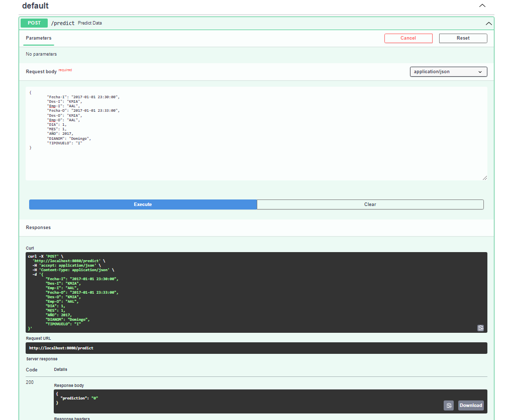
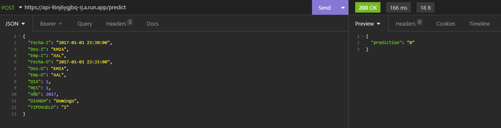
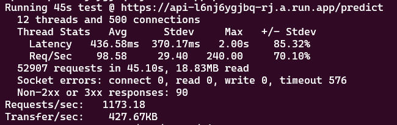

**challenge-mlops**
==============================

El desafio es tomar el modelo de un data scientist y ponerlo en producción para que toda la compañia tenga acceso.

**Organización de Proyecto**
------------

    ├── LICENSE
    ├── Makefile           <- Makefile con comandos make data o make train
    ├── README.md          <- El README de nivel superior para los desarrolladores que utilizan este proyecto.
    ├── data
    │   ├── external       <- Datos de fuentes de terceros.
    │   ├── interim        <- Datos intermedios que han sido transformados.
    │   ├── processed      <- Conjuntos de datos finales y canónicos para el modelado.
    │   └── raw            <- Volcado original e inmutable de datos.
    │
    ├── docs               <- Un proyecto Sphinx predeterminado; consulta sphinx-doc.org para más detalles.
    │
    ├── models             <- Modelos entrenados y serializados, predicciones de modelos o resúmenes de modelos.
    │
    ├── notebooks          <- Cuadernos de Jupyter. 
    │
    ├── references         <- Diccionarios de datos, manuales y otros materiales explicativos.
    │
    ├── reports            <- Análisis generado en HTML, PDF, LaTeX, etc.
    │   └── figures        <- Gráficos y figuras generados para ser utilizados en informes.
    │
    ├── requirements.txt   <- El archivo de requisitos para reproducir el entorno de análisis, por ejemplo,
    │                         generado con `pip freeze > requirements.txt`
    │
    ├── setup.py           <- Hace que el proyecto sea instalable con pip (pip install -e .) para que src se pueda importar.
    ├── src                <- Código fuente para uso en este proyecto.
    │   ├── __init__.py    <- Hace de src un módulo de Python
    │   │
    │   ├── data           <- Scripts para descargar o generar datos
    │   │   └── make_dataset.py
    │   │
    │   ├── features       <- Scripts para convertir datos en características para el modelado
    │   │   └── build_features.py
    │   │
    │   ├── models         <- Scripts para entrenar modelos y luego usar modelos entrenados para hacer
    │   │   │                 predicciones
    │   │   ├── predict_model.py
    │   │   └── train_model.py
    │   │
    │   └── visualization  <- Scripts para crear visualizaciones exploratorias y orientadas a resultados
    │       └── visualize.py
    │
    └── tox.ini            <- Archivo tox con configuraciones para ejecutar tox; consulta tox.readthedocs.io

--------

# **Instalación con ambiente conda**

* Asegúrate de tener conda instalado en tu sistema.
* Clona este repositorio en tu máquina local.
* Navega al directorio del proyecto.
* Crea un nuevo ambiente conda utilizando el archivo requirements.txt:

    conda create -n mi_ambiente --file requirements.txt

Esto creará un nuevo ambiente con el nombre mi_ambiente y con las dependencias especificadas en el archivo requirements.txt.

Activa el ambiente conda:

    conda activate mi_ambiente

Puedes iniciar el servicio con el seguiente comando:

    uvicorn api:app --port 8080

¡Listo! Ahora puedes acceder a la aplicación desde tu navegador en http://localhost:8080/docs

# **Instalación con docker**

* Asegúrate de tener Docker instalado en tu sistema.
* Clona este repositorio en tu máquina local.
* Navega al directorio del proyecto.

Construye la imagen del contenedor utilizando la Dockerfile:

    docker build -t nombre_del_contenedor .

Asegúrate de incluir el punto . al final del comando para que Docker utilice el directorio actual como contexto de construcción.

Ejecuta el contenedor:

    docker run -p 8080:8080 nombre_del_contenedor

Reemplaza puerto_host con el puerto de tu máquina local en el que quieres acceder a la aplicación, y puerto_contenedor con el puerto en el que la aplicación está expuesta en el contenedor.

¡Listo! Ahora puedes acceder a la aplicación desde tu navegador en http://localhost:8080/docs

# **Modelo elegido y cambios sobre el modelo (Punto 1 y 2)**

El modelo elegido para continuar con el proyecto es XGBoost, ya que es una buena opción para selección binaria y se adapta bien a datasets de alta dimensionalidad. Se han realizado pruebas con ambos modelos y se ha comprobado que presentan resultados similares. Sin embargo, aún existen problemáticas importantes sin resolver. Por ejemplo, ¿los modelos presentan mucha variabilidad o sesgo?, ¿cuál es la métrica más importante?, ¿cómo solucionar el problema de desbalance en los datos?, ¿qué resultados obtendríamos si probamos el origen y destino de los vuelos como características? En los gráficos presentados, parecen tener relevancia. ¿Existe algún dato que se pueda sumar a partir de las ciudades de origen y destino?

En este sentido, se ha considerado necesario realizar los siguientes pasos y elecciones:

* XGBoost se ha seleccionado como la mejor opción debido a su capacidad para trabajar con datasets de alta dimensionalidad y para la selección binaria.
* La métrica más importante a considerar es el F1-score, dada la desproporción en la variable de destino. Esto se debe a que no deseamos que el modelo tenga un alto número de falsos positivos ni de falsos negativos. El F1-score es una buena opción ya que considera tanto la precisión como el recall.
* Para resolver el problema de desbalance, se pueden utilizar los hiperparámetros scale_pos_weight y class_weight para asignar un peso a cada clase.
* Si es necesario, se agregarán más características. Se puede reducir su cantidad mediante PCA o seleccionando las características más importantes.
* No se buscarán características externas en otros datos debido al tiempo limitado para el proyecto.
* Una vez hechas estas elecciones, se entrenaron modelos de XGBoost de clasificación binaria utilizando las variables categóricas como one-hot-encoder y también como transformaciones lineales utilizando la librería * category_encoders.

En ambos casos, se realizó una búsqueda de hiper-parámetros con greed search buscando maximizar el F1-score de validación, en donde se consiguieron resultados similares, por lo que se optó por el modelo XGBoost con características de categoría transformadas de forma lineal, ya que la dimensionalidad se reduce por mucho. El F1-score resultante fue más alto que el de los modelos propuestos en "to-expose" y también fue más alto que el obtenido en modelos random.

En el modelo resultante, se encontró que había overfitting, ya que los resultados de entrenamiento eran bastante mejores que los de validación. Por lo que se congelaron los parámetros encontrados y se introdujeron nuevos parámetros que ayudan a reducir la variabilidad. Mediante una búsqueda greed search, se logró reducir el overfitting. Con esto, se obtuvieron los hiper-parámetros finales.

Por último, utilizando los datos de test, se validó que el modelo estaba generalizando correctamente.

Cabe destacar que los resultados, si bien indican que son mejores que los modelos bases, me parece que el resultado final se podría mejorar bastante incluyendo features externas como podría ser el clima, algunos detalles de fechas como feriados, etc.

Para más información de lo realizado, pueden ver el desarrollo de esto en notebooks en el Jupyter Notebook model_selection.ipynb.

# **Serialización del modelo y api rest (Punto 3)**

Se realizó una importante mejora a los métodos encontrados en el notebook "to-expose". Básicamente, se buscó vectorizar todas las operaciones para que estas no tardaran tanto tiempo. En el Jupyter Notebook "model_selection.ipynb" se pueden ver las diferencias. Además, se buscó que estos métodos fueran más limpios y fáciles de leer.

Estas mejoras en los métodos y la inclusión de métodos necesarios para codificar variables, cargar modelos, etc., se integraron en los códigos "build_features", "train_model" y "predict_model". A los cuales se puede acceder de forma sencilla y se pueden agregar test unitarios fácilmente (no se realizó esto por falta de tiempo).

Una vez realizada la serialización del modelo, se desarrolló la API utilizando FastAPI ya que esta biblioteca permite levantar una API en cuestión de minutos. Tal y como se muestra en las instalaciones, se puede levantar este servicio para ser probado en donde existe un método POST para realizar las predicciones del modelo. Dejo unos datos de entrada de ejemplo para utilizar en la llamada.

{ 
	"Fecha-I": "2017-01-01 23:30:00", 
	"Des-I": "KMIA", 
	"Emp-I": "AAL", 
	"Fecha-O": "2017-01-01 23:33:00", 
	"Des-O": "KMIA", 
	"Emp-O": "AAL", 
	"DIA": 1, 
	"MES": 1, 
	"AÑO": 2017, 
	"DIANOM": "Domingo", 
	"TIPOVUELO": "I" 
} 

# **Automatizar el proceso de build y deploy (Punto 4)**

Ya que este challenge es de solo 5 dias se tomo la decision de seleccionar una herramienta rapida y escalable, tal y como me parece que deberia ser al momento de generar un prototipo lo más rapido posible. Esta elección fue utilizar los servicios de google cloud build, docker y run. Se genero el archivo cloudbuild.yaml y mediante configuraciónes de google cloud se automatizo la adquisición de los push a la rama main lo cual gatilla la generación de contenedor en la nube y la creación del servicio cloud run para poder que toda la compañia pueda acceder a esta api. Dentro de la consideraciones de la configuración se tuvo en cuenta la region, los tamaños de las maquinas (pequeños), las concurrencias, el maximo numero de instancias y que sea necesario la autentificación por temas de seguridad. Aqui podemos ver un ejemplo de una llamada realizada al servicio ya en producción en google cloud.

Se utilizó una autentificación por bearer token. 
 

# **Pruebas de estrés (Punto 5)** 

Algunas ideas que podrían mejorar el rendimiento de la prueba son:

* Reducir la cantidad de columnas a codificar y predecir por el modelo.
* Cambiar los métodos utilizados con Pandas por una librería más rápida.
* Aumentar la cantidad máxima de instancias disponibles en Cloud Run.
* Aumentar la cantidad de concurrencias y recursos de cada máquina de Cloud Run.

<small>Project based on the <a target="_blank" href="https://drivendata.github.io/cookiecutter-data-science/">cookiecutter data science project template</a>. #cookiecutterdatascience</small>

